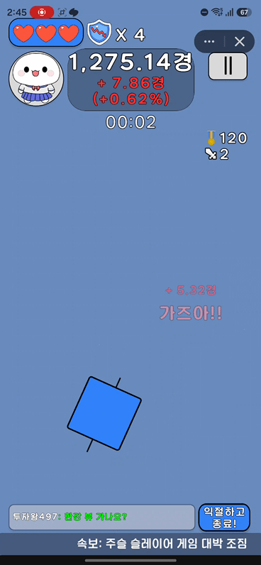
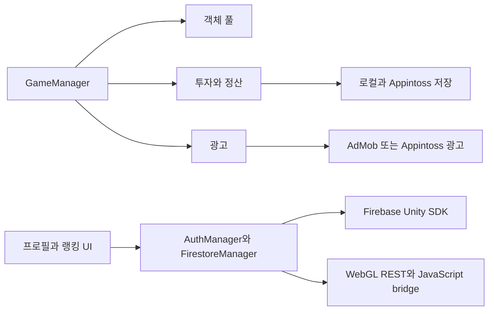

# 주식 슬레이어 (Stock Slayer)

주식 캔들을 베고 투자금을 정산하는 Unity 2D 게임. Google Play의 Android 앱과 Appintoss의 WebGL 게임으로 출시했다.

  

[Google Play](https://play.google.com/store/apps/details?id=com.voyagesoft.stockslayer) · [Appintoss](https://minion.toss.im/XLbPneQB) (토스 앱 전용)

## 게임 소개

투자금과 레버리지를 고른 뒤, 화면에 올라오는 캔들을 드래그로 벤다. 베거나 놓친 타깃에 따라 손익과 체력이 바뀌고, 뉴스 퀴즈·급등·폭락·공매도 이벤트에 맞춰 플레이 방식도 달라진다. 세션을 마치면 투자 결과를 정산하고 상점 구매와 다음 투자로 이어간다.

## At a Glance

| 항목 | 내용 |
|---|---|
| 엔진·언어 | Unity 2022.3 · C# · JavaScript |
| 플랫폼 | Android / Appintoss WebGL |
| 연동 | Firebase Auth · Cloud Firestore · Google Mobile Ads / AdMob |
| 개발·출시 | 개인 프로젝트 · 수동 QA·빌드·업로드 |
| 실사용 | Appintoss Peak DAU 약 181명 |

## 주요 기능

- **투자와 정산:** 투자금·레버리지 선택, 세션 손익 계산과 결과 화면
- **캔들 베기와 시장 이벤트:** 타깃 판정, 뉴스 퀴즈, 급등·폭락·공매도
- **부활과 보상:** 보상 광고를 통한 부활·재화 보상, 운세 확인
- **성장과 꾸미기:**  상점, 아바타·펫·마이룸, 단계별 튜토리얼
- **랭킹 시스템:** 최고 자산·최대 베기·일일 베기 랭킹 시스템 제공

[플레이 화면과 기능별 구현](docs/FEATURE_MAP.md)

## 기술 구성

메뉴·투자는 MainScene, 플레이·부활·결과는 GameScene에서 진행한다. [전체 구조](docs/ARCHITECTURE.md)

## 구현 포인트

- **WebGL bridge:** C# → `.jslib` → 호스트 JavaScript로 요청하고 JSON callback으로 결과를 받는다.
- **Firebase와 저장:** Android는 Firebase Unity SDK, WebGL은 REST 조회와 JavaScript bridge 쓰기를 사용한다. 세션 투자금은 backup을 남겨 다음 초기화 때 회수한다.
- **광고 처리:** AdMob과 Appintoss 광고를 분기하고, 보상 획득과 화면 닫힘을 구분해 부활·재화 지급에 연결한다.
- **객체 수명:** 반복 생성하는 타깃과 일부 효과는 prefab별 Queue에서 재사용한다.
- **랭킹:** Cloud Firestore에 최고 자산·최대 베기 기록과 일일 베기 수를 저장하고, 항목별 상위 랭킹을 조회한다. Appintoss에서는 플랫폼 리더보드에도 점수를 제출한다.

## 출시와 운영

출시 후 실제 사용자 반응을 보며 패치했다. Appintoss 연동, 빌드 용량 조정, 모바일 Safe Area 대응을 거쳤으며, Google Play에는 최신 기능 일부가 반영되지 않았다. [제작·운영 기록](docs/PRODUCTION_HISTORY.md) · [DAU 추이](docs/METRICS.md)

## 코드 샘플

| 주제 | 파일 |
|---|---|
| 객체 풀링 | [ObjectPoolSample.cs](samples/performance/ObjectPoolSample.cs) |
| WebGL 왕복 | [C#](samples/platform/FirestoreWebGLSample.cs) · [jslib](samples/platform/FirebaseBridge.sample.jslib) |
| 세션 저장·복구 | [SessionPersistenceSample.cs](samples/persistence/SessionPersistenceSample.cs) |
| 보상 광고 | [RewardAdLifecycleSample.cs](samples/monetization/RewardAdLifecycleSample.cs) |

## 상세 문서

[샘플 설명](samples/README.md) · [기술 스택](docs/TECH_STACK.md) · [출시 과정](docs/RELEASE_PIPELINE.md) · [아트·음원·VFX](docs/ART_AND_ASSETS.md)

## 현재 알려진 문제

일부 Android/iOS 환경에서 시작·로딩 중 흰 화면과 재시작이 발생했다. 정확한 종료 원인은 규명하지 못했으며, [iOS/WebGL 메모리 조사 기록](docs/postmortems/IOS_WEBGL_OOM.md)에 시도와 관찰 내용을 정리했다.

## 소스 공개 범위

C#과 JavaScript bridge는 AI의 도움을 받아 작성하고 이해·통합했다. 이 저장소에는 정제한 코드 발췌를 담았으며 전체 게임 소스나 실행 가능한 Unity 프로젝트는 제공하지 않는다. [공개 범위](docs/SECURITY_AND_REDACTION.md) · [이용 안내](LICENSE.md)
