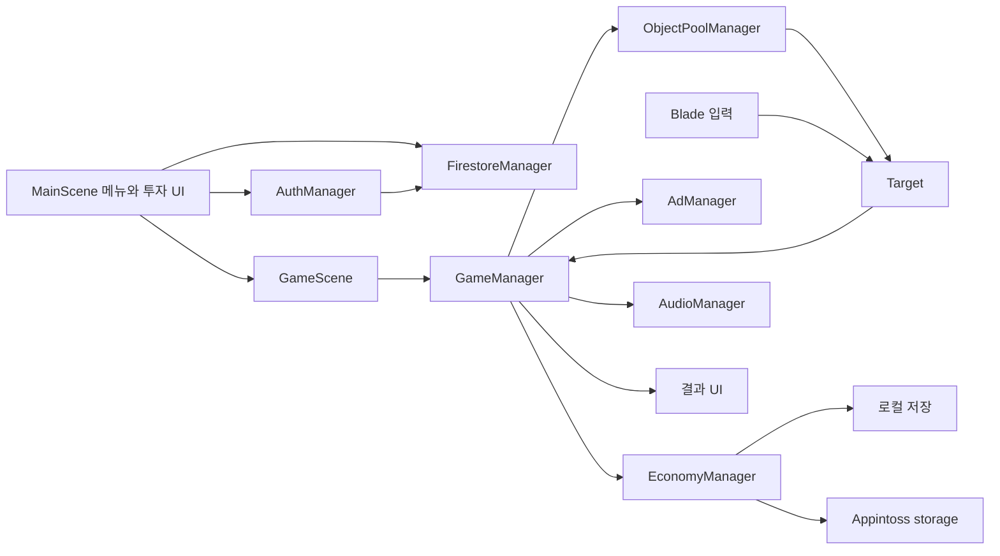
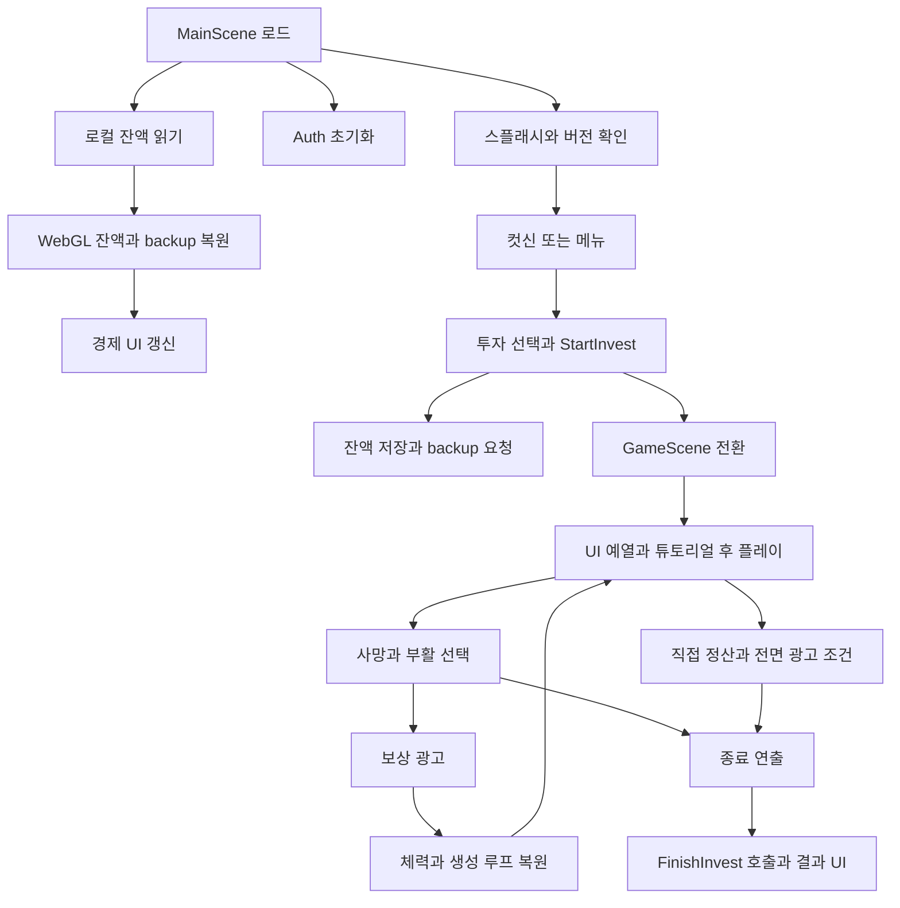
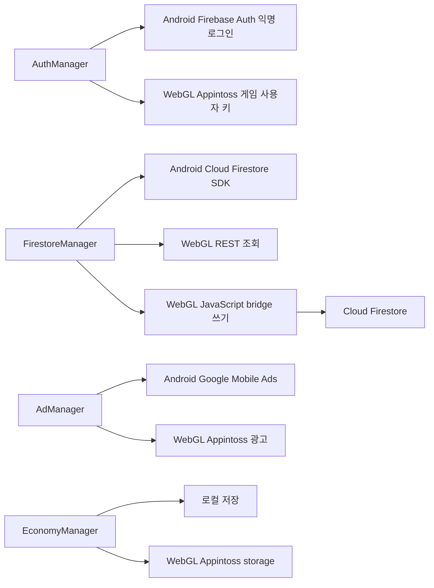

# Architecture

## 전체 구조

MainScene은 메뉴·투자·프로필을, GameScene은 플레이·부활·결과를 담당한다. MonoBehaviour의 Singleton, Inspector 참조, event와 coroutine으로 연결되어 있다.

Auth·Firestore·Economy·Ad·Audio manager는 `DontDestroyOnLoad`로 씬을 넘어 유지되는 경로가 있다. GameManager와 객체 풀은 씬에 속한다.

## 게임 실행 흐름

로비에서 투자금과 레버리지를 선택하면 잔액을 갱신하고 GameScene으로 전환한다. 튜토리얼과 UI 예열 후 타깃 생성이 시작되고, 베기 판정과 시장 이벤트에 따라 손익·체력이 바뀐다.

사망 시 시간 배율을 낮춘 뒤 realtime 대기를 거쳐 게임을 멈춘다. 광고 표시 요청이 수락되면 부활 popup의 타이머를 멈추고, 보상 callback에서 체력과 생성 루프를 복원한다. 부활 이후 사망, skip, 직접 정산은 각각의 종료 진입점을 거쳐 결과 화면으로 이어진다.

## 핵심 시스템

| 시스템 | 게임에서 맡는 역할 |
|---|---|
| GameManager | 세션 상태, 스폰 패턴, 시장 이벤트, HUD, 부활·종료 |
| Blade / Target | 드래그 입력, 충돌·베기 판정, 타깃 상태와 피드백 |
| EconomyManager | 자산·투자·수익 계산, 저장과 backup 회수 |
| AuthManager / FirestoreManager | 플랫폼별 식별, 프로필·기록·랭킹·쿠폰 |
| AdManager / AudioManager | 광고 공급자 호출, 보상·오디오 처리 |
| UI controller | 메뉴·투자·부활·결과 화면과 manager 연결 |

GameManager가 플레이 흐름의 여러 책임을 함께 맡는다. 게임 상태는 bool·timer·enum과 coroutine으로 관리한다.

## 저장 구조

투자 시작에 잔액에서 원금을 빼고 WebGL의 Appintoss storage에 진행 중 투자금 backup을 남긴다. 다음 초기화에서는 잔액을 불러온 뒤 backup을 더하고 삭제한다. 정산에서는 최종 현금을 잔액에 더하고 backup을 제거한다.

로컬 저장과 Appintoss storage를 함께 사용한다. 장착·튜토리얼·설정은 별도 로컬 상태로 관리하며, 모든 게임 상태를 동기화하는 cloud save 구조는 아니다. [저장·복구 샘플](../samples/persistence/README.md)

## 플랫폼 분기

주로 `UNITY_WEBGL && !UNITY_EDITOR` 조건으로 분기한다. Android는 Firebase Unity SDK를 사용하고, WebGL은 REST 조회와 JavaScript bridge 쓰기를 혼용한다. Android의 Firebase Auth 익명 로그인과 Appintoss의 게임 사용자 키 취득은 별개의 식별 경로다.

## 기록과 랭킹

FirestoreManager가 사용자별 최고 자산·최대 베기 기록을 갱신하고 일일 베기 수를 누적한다. RankingManager는 선택한 항목의 상위 기록을 조회해 랭킹 화면에 표시한다. 자산 랭킹은 prestigeCount를 우선하고 최고 자산 순으로 정렬한다.

Android는 Cloud Firestore SDK를, WebGL은 REST 조회와 JavaScript bridge 쓰기를 사용한다. Appintoss에서는 별도로 플랫폼 리더보드에 점수를 제출하고, 게임 안의 버튼으로 리더보드를 연다.

## WebGL JavaScript Bridge

C#의 `DllImport("__Internal")` 호출을 `.jslib`에서 받아 UTF8 포인터를 문자열로 바꾼다. 호스트 객체가 준비되면 JavaScript 함수를 호출하고, 결과는 `SendMessage`의 JSON으로 Unity에 돌아온다.

쿠폰 샘플은 요청과 응답의 연결을, 호스트 준비 polling은 Unity와 호스트의 초기화 시차를 다룬다. 이 polling은 네트워크 실패 재시도와 구분된다. [C#과 jslib 샘플](../samples/platform/README.md)

## 광고 처리

Google Play는 AdMob, Appintoss는 플랫폼 광고를 사용한다. 보상 획득에서 flag를 세우고 화면이 닫힐 때 게임 callback을 호출해 부활·재화 보상으로 연결한다.

native callback은 `Update`의 Action으로 넘기고, WebGL은 load/show 구독 해제 handle을 교체하며 파괴 시 해제한다. 광고 실패·닫힘에서는 오디오를 복원하고 다음 광고를 로드한다. [보상 광고 샘플](../samples/monetization/README.md)

## 객체 수명과 Pooling

prefab instance ID별 Queue에서 타깃과 일부 효과를 재사용한다. 큐 안에서 이미 파괴된 항목은 건너뛰고, 등록되지 않은 객체를 반환하면 파괴한다. 상태·물리·tween reset은 Target이 처리한다. 일부 일회성 효과와 부활 경로는 기존 `Instantiate/Destroy` 흐름을 유지했다. [객체 풀 샘플](../samples/performance/README.md)

[기능 지도](FEATURE_MAP.md) · [기술 스택](TECH_STACK.md)
