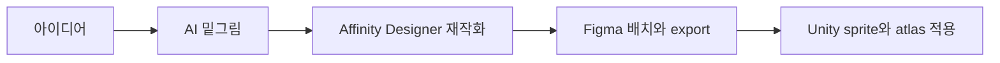
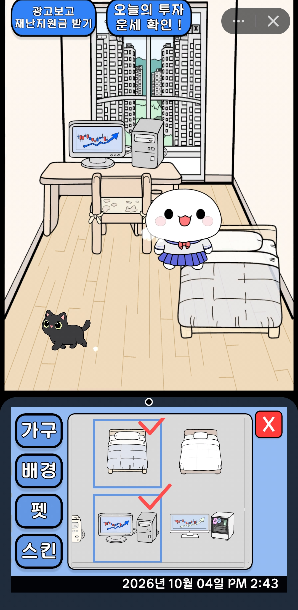

# 아트·음원·VFX 제작

## 아트와 UI

캐릭터·배경·아이콘·컷신은 AI로 밑그림을 만든 뒤 iPad의 Affinity Designer에서 벡터화·단순화하고 다시 그렸다. PC의 Figma에서 화면을 배치하고 export했다. UI도 Figma에서 구성했다.

  

캐릭터와 배경, UI에 쓰이는 이미지는 재작화와 배치 과정을 거쳐 Unity sprite로 적용했다.

## 음원 구성과 편집

| 범주 | 출처 | 작업 |
|---|---|---|
| 효과음 | Pixabay | Audacity에서 컷·볼륨·pitch·format 조정 |
| 배경음악 | DOVA-SYNDROME | 게임 배경음악으로 적용 |

음원은 외부 자료를 사용했으며 직접 작곡하지 않았다. 효과음은 잘라 쓰거나 볼륨·pitch를 바꾸고 필요한 format으로 변환했다.

## VFX 적용

Cartoon FX Remaster, Simple Stylized Slash vol2, UNI VFX, Hits Effects FREE를 사용했다. 각 효과의 particle·material·색·크기·lifetime을 게임 화면에 맞춰 조정했다.

## Unity 적용과 용량 조정

sprite·음원 압축과 atlas를 조정해 Appintoss의 빌드 허용 용량에 맞췄다. 용량 조정은 배포 준비 작업이었으며 실행 중 메모리 문제의 해결로 설명하지 않는다.

## 자료 이용 안내

이 저장소에는 게임 화면과 아트 예시를 담았다. 외부 음원·VFX·폰트의 원본과 편집 파일, Asset Store 패키지는 재배포하지 않는다. 해당 자료는 공급자의 이용 조건을 따르며, 게임에 적용하거나 수정했다고 재배포 권리가 생기는 것은 아니다.

[공개 범위](SECURITY_AND_REDACTION.md) · [제작·운영 기록](PRODUCTION_HISTORY.md)
