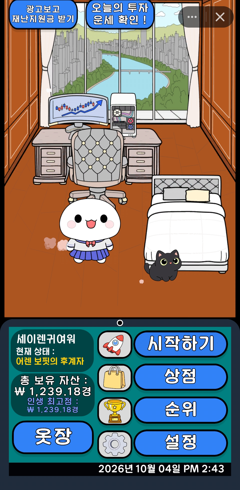
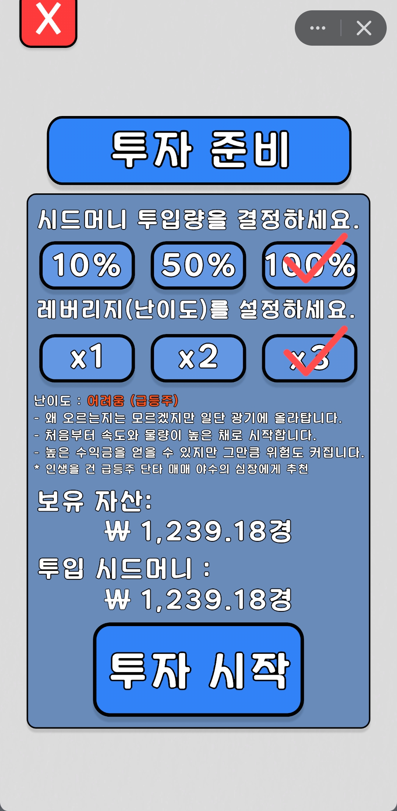
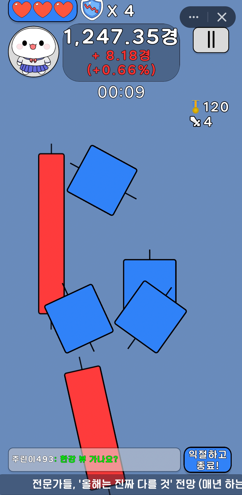
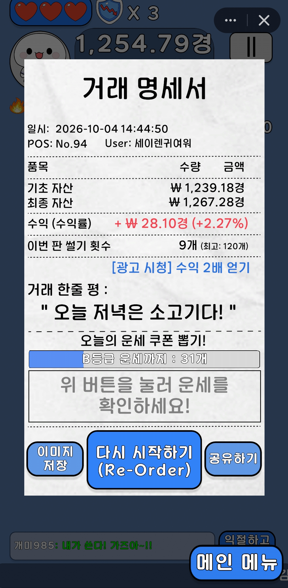
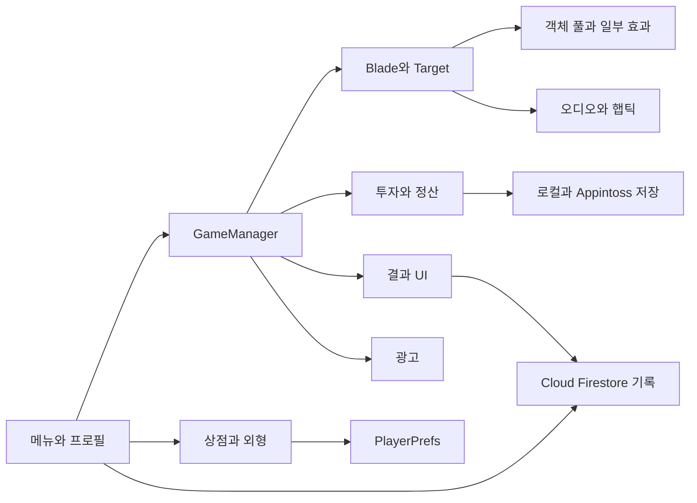

# 게임 기능

Stock Slayer는 투자 준비 → 캔들 베기 → 결과 정산 → 성장·꾸미기로 이어진다. 아래는 플레이어가 만나는 기능과 이를 연결하는 주요 시스템이다. Google Play에는 최신 기능 일부가 반영되지 않아 플랫폼별 제공 범위가 다르다.

## 플레이 흐름과 기능

| 플레이 영역 | 기능 | 주요 시스템 |
|---|---|---|
| 로비 / 투자 준비 | 투자금과 레버리지 선택, 메뉴·프로필 진입 | 투자 UI, EconomyManager, ProfileManager |
| 핵심 게임플레이 | 드래그로 캔들 베기, 타깃별 손익·체력 변화, HUD와 피드백 | Blade, Target, GameManager, InGameUI |
| 시장 이벤트 | 뉴스 퀴즈, 급등·폭락·공매도에 따른 타깃과 판정 변화 | GameManager, NewsGame |
| 정산 / 결과 | 직접 정산 또는 세션 종료, 손익 표시와 기록 반영 | EconomyManager, ResultViewController, FirestoreManager |
| 광고 / 부활 | 보상 광고로 부활·재화 보상, 종료 경로의 전면 광고 | AdManager, RevivePopupController |
| 프로필 / 랭킹 | 닉네임·자산·기록 조회, 순위·쿠폰·일일 랭킹 저장·조회 | AuthManager, FirestoreManager, RankingManager, ProfileManager |
| 상점 / 아바타 / 마이룸 | 아이템 구매·성장, 아바타·펫·가구·배경 선택과 상호작용 | ShopManager, MyRoomManager, AvatarController |
| 운세 / 보상 | 베기 기록에 따른 운세 확인, 보상 광고를 통한 재확인 | FortuneManager, ResultViewController, AdManager |
| 튜토리얼 | 투자 설정·베기·뉴스·정산·상점 이용 안내와 건너뛰기 | TutorialManager, TutorialUIManager |
| 저장 / 플랫폼 연동 | 자산 저장과 투자금 backup 회수, Safe Area·햅틱·공유·플랫폼 랭킹 | EconomyManager, PlayerPrefs, SafeArea, VibrationManager, Appintoss 연동 코드 |

뉴스는 게임에 내장된 문구를 사용한다. 투자와 손익은 게임 안의 수치 계산이며, 실제 금융 거래를 연결하는 기능이 아니다.

## 화면 흐름

메인 → 투자 준비 → 플레이 → 결과 정산

## 기능 연결

입력 판정은 타깃 상태와 GameManager로 이어지고, 결과 화면은 경제 계산·기록·광고와 연결된다. 상점과 외형 상태에는 PlayerPrefs를 사용한다.

[코드 샘플](../samples/README.md)
