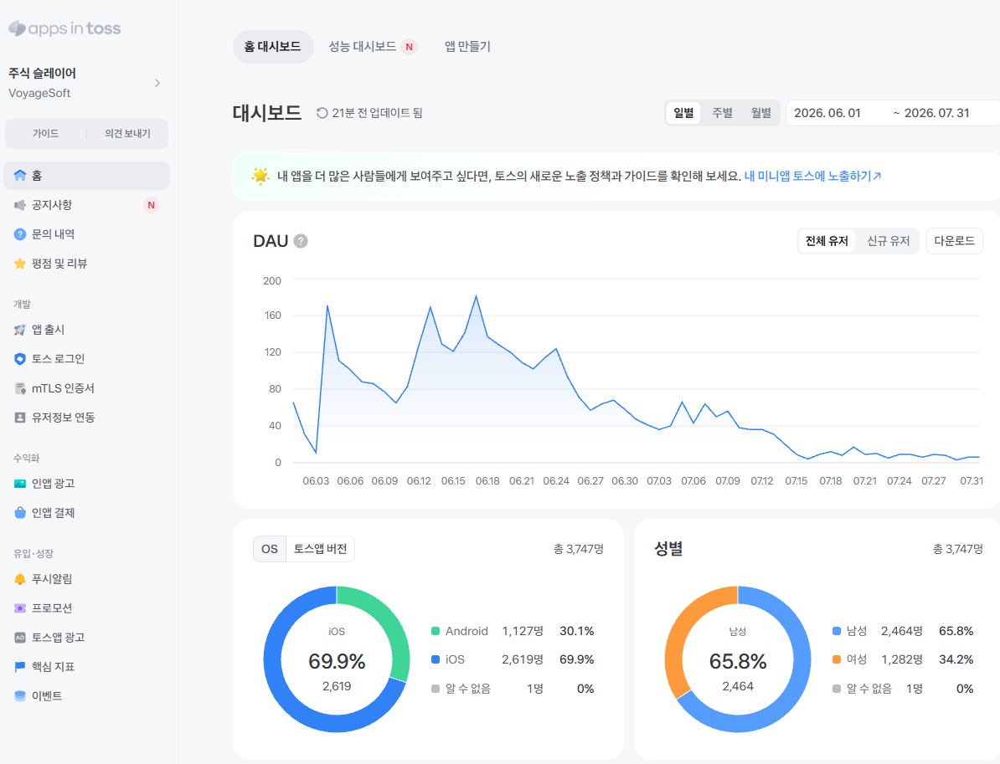

# 운영 지표

## Appintoss 이용

Appintoss의 Peak DAU는 약 **181명**이었다. 아래는 출시 후 이용 추이를 보여주는 Appintoss dashboard의 일별 DAU 캡처다.

캡처 조회 기간: **2026-06-01~2026-07-31**.

이 수치는 Appintoss에 한정되며 Google Play 이용량을 합친 값이 아니다. 약 181명은 운영 중 dashboard에서 확인한 근사치로, 정확한 peak 날짜는 기재하지 않았다.

## 출시 후 추이

초기 이용 구간 이후 활동 사용자가 줄었다. 콘텐츠 업데이트 부족과 일부 기기의 시작·로딩 문제를 감소 요인으로 의심했지만, 기기별 실패율·이탈 데이터의 대응이 없어 직접적인 인과관계는 확인하지 못했다. [메모리 조사 기록](postmortems/IOS_WEBGL_OOM.md)

[제작·운영 기록](PRODUCTION_HISTORY.md)
