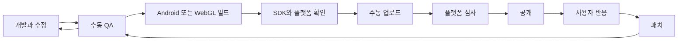

# 출시 과정

개발·QA, Android/WebGL 빌드, SDK·플랫폼 확인, 업로드·심사와 패치를 수동으로 진행했다.

## Android / Google Play

Unity의 Android IL2CPP 빌드와 Gradle 의존성을 사용했다. Firebase Unity SDK와 Google Mobile Ads를 연결하고 Google Play에 업로드했다.

QA 중 테스트기로 모바일 UI 잘림을 확인하고 Safe Area와 anchor를 조정했다. 기능 수정과 QA를 반복하면서 배포를 준비했다.

## WebGL / Appintoss

Appintoss SDK의 WebGL template·호스트 빌드 도구를 사용하고 게임의 JavaScript bridge를 연결했다. 함수명·Firebase 연결 문제는 호출 이름과 연동 로직을 수정해 대응했다.

플랫폼의 빌드 용량 제한을 넘었을 때 sprite·음원 압축과 atlas를 조정해 빌드를 통과했다. 출시 후에도 사용자 반응을 확인하며 패치를 진행했다.