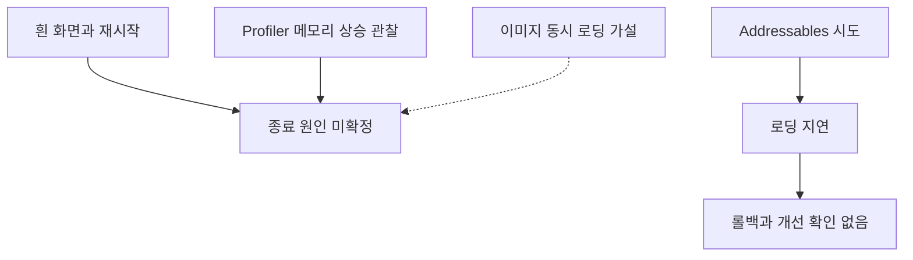

# iOS / WebGL 흰 화면·재시작

## 증상

운영 중 게임 시작·로딩에서 흰 화면이 뜨거나 앱이 재시작되는 현상을 관찰했다. 확인한 기기는 Galaxy S25와 iPhone 13 mini이며 일부 Android/iOS 환경에서 문제가 남아 있었다.

사건별 OS·WebView·빌드·발생률과 Android native/WebGL 구분 기록은 부족하다. 종료 로그가 없어 메모리 부족에 의한 종료 자체를 확정하지 못했다.

## 메모리 관측

Memory Profiler에서 첫 실행 시 약 600 MB의 메모리 상승을 관찰했다. 측정 환경·항목·기준선과 실패 기기에서의 대응이 분명하지 않아 이 값을 총 메모리나 종료 원인으로 해석하지 않는다.

WebGL 메모리 설정은 초기 128 MB·최대 512 MB다. 이는 전체 WebView·GPU 메모리가 아니며, 범주가 다른 약 600 MB 상승과 직접 비교할 수 없다.

## 조사와 시도

이미지를 한꺼번에 불러오는 과정의 메모리 사용을 의심해 Addressables를 시도했다. 로딩이 더 느려져 롤백했고 문제의 개선은 확인하지 못했다.

그림은 관측·가설·시도의 관계를 나타낸다. 객체 풀과 직접 생성·파괴 경로가 섞여 있고, lowMemory·GC·UnloadUnusedAssets 정리 코드도 있다. 기기별 효과를 측정하지 못해 특정 경로를 누수 원인이나 해결책으로 지목하지 않았다. Addressables 실험 코드 역시 일부 남아 있다.

## 종료 원인

정확한 종료 원인은 규명하지 못했다. 이미지·texture 참조, JS/WASM heap, native·GPU 메모리와 종료 사유를 구분해 좁힐 자료가 충분하지 않았다.

## 사용자 감소와의 관계

시작·로딩 문제와 콘텐츠 업데이트 부족을 감소 요인으로 의심했다. 그러나 기기별 실패율·사건 시점·이탈 데이터가 대응하지 않아 OOM이 DAU 감소의 직접 원인이라고 결론 내릴 수 없다. [운영 지표](../METRICS.md)
